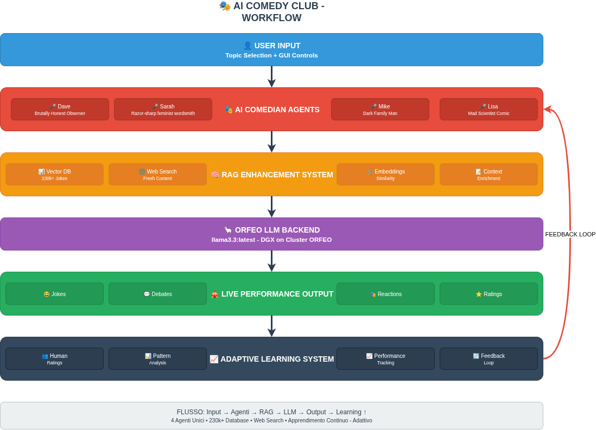
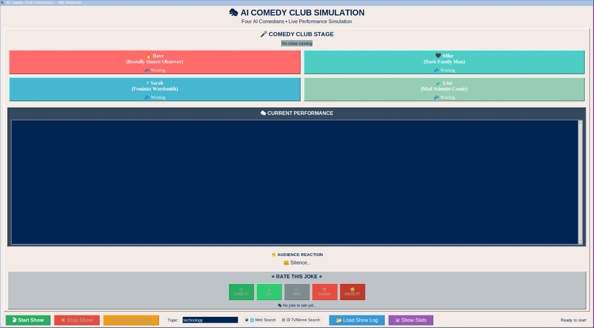

# AI Comedy Club
## Can AI Agents learn to be funny?

#### Roberta Lamberti & Edoardo Cortolezzis
*Università degli Studi di Trieste - a.a. 2024-2025*
**28 July 2025**

---

# The Research Question

## Can we simulate comedy?

This project explores a core question: **Is it possible to simulate the complex, creative, and social art of stand-up comedy using a system of LLM-powered AI agents?**

We aimed to build a system where AI comedians could:
- Generate original, topic-based jokes.
- Develop and maintain unique comedic styles.
- Interact with each other in a believable way.
- Learn from feedback to improve their performance.

---

# Models & Technology

The project is built on a stack of modern AI tools and techniques.

1.  **Core Language Model**: `llama3.3:latest` (running on a orfeo DGX partition node via port forwarding) provides the core generative power. 
2.  **Multi-Agent System**: A custom Python framework manages the state, interactions, and performance flow of four distinct comedian agents.
3.  **Enhanced Prompting (RAG)**: To provide comedians with inspiration and context.
4.  **Adaptive Learning**: A feedback loop to allow the system to learn and evolve.

---

# LLAMA3.3:latest

*(llama3 model)

---

# The Comedians: Agent Personalities

Four agents with distinct personalities and humor styles were created.

    <h4>Dave (Edgy)</h4>
    
Pushes boundaries with a dark, brutally honest twist on life.

    <h4>Sarah (Sharp Wit)</h4>
    
Self-deprecating one-liners that make sharp points about modern society.

    <h4>Mike (Everyman)</h4>
    
Finds surprising depth and absurdity in mundane, everyday situations.

    <h4>Lisa (Intellectual)</h4>
    
Intellectually twisted humor with scientific references and clever wordplay.

---

# RAG: Giving Comedians Inspiration

Jokes aren't generated in a vacuum. We use a **Retrieval-Augmented Generation (RAG)** pipeline to ground the LLM.

- **Sentence Embeddings**: A dataset of 230,000+ jokes is converted into vectors using `all-MiniLM-L6-v2`.
- **Vector Search**: When given a topic, the system performs a cosine similarity search to find relevant joke examples.
- **Web Search**: The system also searches the web for fresh, topical content, keeping the jokes relevant.

This context is then fed into the prompt, giving the comedian a rich foundation for their joke.

---

# Adaptive Learning: Getting Funnier

The system learns from feedback using an `AdaptiveComedySystem`.

1.  **Rate Jokes**: The user rates jokes during the show.
2.  **Analyze Performance**: The system analyzes patterns in the ratings for each comedian. It identifies which topics, styles, or joke structures work best.
3.  **Generate Suggestions**: It creates concrete suggestions for improvement (e.g., "Your observational style on 'technology' is highly rated. Focus more on that.").
4.  **Refine Prompts**: These suggestions are used to refine the base prompts for the comedians, creating a continuous learning loop.

---

# The Project Pipeline

This is how a topic becomes a joke on stage.

  

---

# Results: The GUI Experience

The simulation is controlled through a custom GUI built with Tkinter. It provides:
- Real-time display of the comedy show.
- Controls for starting/stopping the show and selecting topics.
- Visualization of the comedians and their interactions.
- A system for rating jokes to provide feedback.

---

# GUI

  

---

# Results: The Jokes

Here are some examples of jokes generated by the system.

**Topic**: *[Example Topic 1]*
> **Comedian**: *[Example Joke 1]*

**Topic**: *[Example Topic 2]*
> **Comedian**: *[Example Joke 2]*

**Topic**: *[Example Topic 3]*
> **Comedian**: *[Example Joke 3]*

*(A curated list of the best topic-joke combinations will be added here)*

---

# Future Improvements

The project has a clear path forward for making the comedy even better.

- **Refine Agent Personas**: Further refine the system prompts and RAG filtering to better match each comedian's unique style.
- **Voice Synthesis**: Give each agent a unique voice using text-to-speech (TTS) technology to enhance the performance.
- **Deeper Learning**: Implement more advanced Reinforcement Learning from Human Feedback (RLHF) to allow for more nuanced learning from audience reactions.
- **Implement the CARLIN Method**: Use a multi-stage process for deeper analysis and iterative refinement to generate more original humor.

---

# Critically Analyze Reality, Link Insightful Notions

carlin image

---

# Conclusion

- **Promising Results**: The system demonstrates a strong capability for generating style-consistent, context-aware jokes. The pipeline combining a local LLM, RAG, and adaptive learning proved to be a solid foundation.
- **Current Limitations**: However, joke quality is inconsistent. While some outputs are genuinely funny, others can be confusing or lack a true comedic punch, highlighting the challenge of replicating nuanced human humor.
- **Valuable Insights**: This work serves as an effective proof-of-concept, revealing both the potential and the current hurdles of using AI for complex creative tasks.

With the right settings,  AI can replicate different humor styles, as shown in our implementation. Nonetheless, there is still great room for improvement.

---

# Thank You!

**Project Repository**: https://github.com/robonoff/DeepLearningTest
