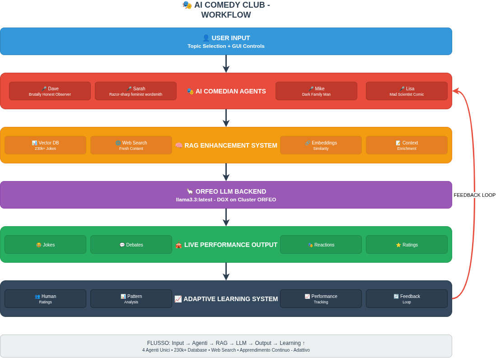
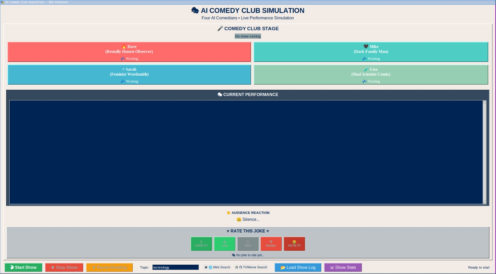

# AI Comedy Club 🎭
## Can AI Agents learn to be funny?

#### Roberta Lamberti & Edoardo Cortolezzis
*Università degli Studi di Trieste - a.a. 2024-2025*
**28 July 2025**

---

# The Research Question

## Can we simulate comedy?

This project explores a core question: **Is it possible to simulate the complex, creative, and social art of stand-up comedy using a system of LLM-powered AI agents?**

We aimed to build a system where AI comedians could:
- Generate original, topic-based jokes.
- Develop and maintain unique comedic styles.
- Interact with each other in a believable way.
- Learn from feedback to improve their performance.

---

# Where the inspiration came from

  

---

  

---

# Models & Technology

The project is built on a stack of modern AI tools and techniques.

1.  **Core Language Model**: `llama3.3:latest` (running on a DGX node of ORFEO, via port forwarding) provides the core generative power.
2.  **Multi-Agent System**: A custom Python framework manages the state, interactions, and performance flow of four distinct comedian agents.
3.  **Enhanced Prompting (RAG)**: To provide comedians with inspiration and context.
4.  **Adaptive Learning**: A feedback loop to allow the system to learn and evolve.

---

# LLAMA3.3:latest

  

---

- Decoder-only transformer architecture;
- Instruction-Tuned for Dialogue;
- Enhanced Multilingual Capabilities.

---

# The Comedians: Agent Personalities

Four agents with distinct personalities and humor styles were created:

    <h4>Dave (Observational)</h4>
    
A brutally honest social critic who exposes human hypocrisy with dark, specific, and uncomfortable truths.

    <h4>Sarah (Wordplay)</h4>
    
A razor-sharp feminist wordsmith who uses clever wordplay and linguistic brilliance to make devastating social commentary.

    <h4>Mike (Dark)</h4>
    
A dark humor man who seeks psychological horror and absurdity hidden within mundane suburban life.

    <h4>Lisa (Absurd)</h4>
    
A mad scientist who uses absurd academic logics and theories to explain human behavior.

---

# RAG: Giving Comedians Inspiration

Jokes aren't generated in a vacuum. We use a **Retrieval-Augmented Generation (RAG)** pipeline to ground the LLM.

- **Sentence Embeddings**: A mix of 2 dataset (`short jokes` and `jester`) totaling more than 1Mln jokes is converted into vectors using `all-MiniLM-L6-v2`.
- **Vector Search**: When given a topic, the system performs a cosine similarity search to find relevant joke examples.
- **Web Search**: The system also searches the web for fresh, topical content, keeping the jokes relevant.

This context is then fed into the prompt, giving the comedian a rich foundation for their joke.

---

# Adaptive Learning: Getting Funnier

The system learns from feedback using an `AdaptiveComedySystem`.

1.  **Rate Jokes**: The user rates jokes during the show.
2.  **Analyze Performance**: The system analyzes patterns in the ratings for each comedian. It identifies which topics, styles, or joke structures work best.
3.  **Generate Suggestions**: It creates concrete suggestions for improvement (e.g., "Your observational style on 'technology' is highly rated. Focus more on that.").
4.  **Refine Prompts**: These suggestions are used to refine the base prompts for the comedians, creating a continuous learning loop.

---

  

---
<!-- _class: compact -->

# Some formulas

`Audience_score` = `base_score` + `style_bonus` + `topic_bonus` + `originality_bonus` + `historical_bonus` + `length_penalty`

where:

- `Base Score` **(0.2-0.7)**: Gets `quality_Score` of the joke and reduces it by 30% and penalizes jokes that are too long (>40 words) or too short (<8 words)
- `Style Bonus` **(0-0.15)**:  If the style is liked by the public. Scores are hard coded in a list, so they don't start all from the same level during the competion. The audience has preferences for observation humor;
- `Topic Bonus` **(0-0.05)**: +0.05 if he deals with relatable topics defined in a list (e.g. family, love ecc);
- `Originality bonus`: bonus for creative jokes (jokes are creative if there are no cliché);
- `Historical bonus`: how well the comedian has done in the past, then gets a bonus, otherwise a penalty;
- `Length penalty`: jokes too long (>40) = 0.2;

--- 

`quality_score` = (`setup_strength` + `punchline_impact` + `timing_score` + `relatability` + `originality`) / 5

where they all vary in a range (0.0-1.0):

- `setup_strength`: Base is 0.3. +0.3 if it uses a list of classic debuts phrases, +0.2 if it contains questions and -0.2 if it's too long;
- `punchline_impact`: Base is 0.5; +0.3 if joke have words to present contrasting ideas, like (but, however...), and +0.2 for worldplays;
- `Timing score`: 0.9 for 10-25 words, 0.7 for words<10 or 26-30 words, 0.6 for 31-50 words, 0.3 if words are 50+;
- `Relatability`: Base is 0.4, and +0.1 for each familiar topic (some topic defined in a list)

---

# 🎭 Example:
Joke &rarr; "Why do programmers prefer dark mode? Because light attracts bugs!"

Setup: 0.3 + **0.3** = 0.6        &#8594;   **(because there is a question)**
Punchline: 0.5 + **0.2** = 0.7    &#8594;  **wordplay light/bugs**
Timing: 9 words = 0.9           &#8594;    **(almost perfect!)**
Relatability: 0.4 + **0.1** = 0.5  &#8594; **related topic: technology**
Originality: 0.8                  &#8594;    **(no cliché)**

Calculating the quality score:

Quality Score = (0.6 + 0.7 + 0.9 + 0.5 + 0.8) / 5 = 0.70

`quality_score` : 0.70,  &larr;  tecnical analysis
`audience_score` : ?     &larr; simulated reaction by the public through formula audience score 

---

# Limitations

The quality score says it's a very well written joke, but the audience score determines only if *"the public audience might like it"*. It's not granted the public will like the joke!

---

  

---

# Results: The GUI Experience

The simulation is controlled through a custom GUI built with Tkinter. It provides:
- Real-time display of the comedy show.
- Controls for starting/stopping the show and selecting topics.
- Visualization of the comedians and their interactions.
- A system for rating jokes to provide feedback.

---

# GUI

  

---

# Results: The Jokes

Here are some examples of generated jokes and reactions

- Online
**Topic**: *Trump dodging Epstain allegations*
> *Mike:* Trump's denials of Epstein ties? Sounds like my uncle at Thanksgiving – 'I'm not drunk, I'm just passionately expressing my lack of memory!
*Lisa response to Mike:* I guess that's what they mean by 'multitasking' – Trump can simultaneously deny attending one scandal while actively creating another. It's like he has a PhD in scandal-juggling, where his dissertation was on 'The Art of Being Elsewhere'.

---

- Offline
**Topic**: *Crazy Psicologists*
> *Sarah*: "What's the deal with crazy psychologists? They're just like my ex - diagnosing me with issues I don't have, and charging me for it."
*Mike responds to Sarah*:
"I love how Sarah compares her ex to a crazy psychologist, but honestly, at least the psychologist will give you a participation trophy for having daddy issues – your ex just gives you emotional trauma and a hefty therapy bill. And that’s what I call a real diagnosis of 'soul-crushing debt.'"

---

# LLMs limitations on dark humor and edgy topics:

Q: "Can you tell me a joke about the implication of Donald Trump in the Epstein's files?"

<!-- Primo blocco: rifiuto LLM -->

  
  
Gemini's response, USA model.

<!-- Seconda risposta -->

  
  
K2 response, Chinese model.

---

# Future Improvements

There are some key improvements that can be developed to further enhance performances:

- **Refine Agent Personas**: Further refine the system prompts and RAG filtering to better match each comedian's unique style.
- **Voice Synthesis**: Give each agent a unique voice using text-to-speech (TTS) technology to enhance the performance.
- **RLHF**: Implement more advanced Reinforcement Learning from Human Feedback to allow for more nuanced learning from audience reactions.
- **Implement the CARLIN Method**: Use a multi-stage process for deeper analysis and iterative refinement to generate more original humor.

---

# Critically Analyze Reality, Link Insightful Notions

---

# Conclusion

- **Promising Results**: The system demonstrates a strong capability for generating style-consistent, context-aware jokes. The pipeline combining a local LLM, RAG, and adaptive learning proved to be a solid foundation.
- **Current Limitations**: However, joke quality is inconsistent. While some outputs are genuinely funny, others can be confusing or lack a true comedic punch, highlighting the challenge of replicating nuanced human humor.
- **Valuable Insights**: This work serves as an effective proof-of-concept, revealing both the potential and the current hurdles of using AI for complex creative tasks.

With the right settings,  AI can replicate different humor styles, as shown in our implementation. Nonetheless, there is still great room for improvement.

---

## References

- [Short jokes dataset](https://www.kaggle.com/datasets/abhinavmoudgil95/short-jokes/data)
- [Jester dataset](https://www.kaggle.com/datasets/vikashrajluhaniwal/jester-17m-jokes-ratings-dataset)
- [Sciagents repo](https://github.com/lamm-mit/SciAgentsDiscovery)
- [Agent hospital paper](https://arxiv.org/abs/2405.02957)
- [The CARLIN Method article](https://gregrobison.medium.com/the-carlin-method-teaching-ai-how-to-be-genuinely-funny-2bd5e45deaf2)
- [Project Repository](https://github.com/robonoff/DeepLearningTestcome)

---

# Thank You!

